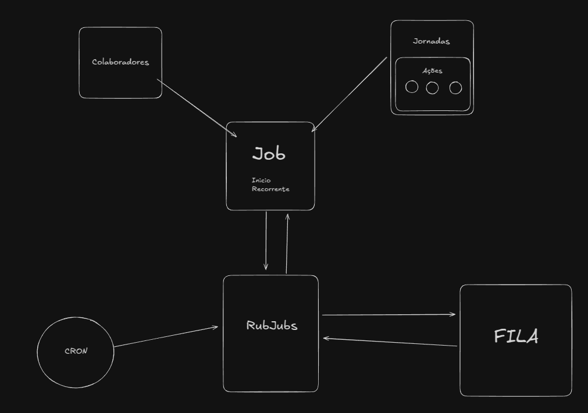

# Schedule Jobs

## Introdução

O projeto **Schedule Jobs** é uma API desenvolvida para facilitar a administração de um serviço que permite o cadastro de colaboradores e jornadas de trabalho. Com esta API, é possível associar colaboradores a suas respectivas jornadas e agendar a execução dessas jornadas de forma eficiente.

Além disso, o projeto conta com um cron job que é executado diariamente à meia-noite, responsável por identificar quais jobs devem ser executados no dia seguinte. Isso garante que todas as atividades programadas sejam realizadas de maneira oportuna e organizada.

## Problema a Ser Resolvido

A necessidade central deste projeto é permitir o **agendamento automático da execução de ações** dentro de jornadas de trabalho.

- Cada **colaborador** pode ser associado a uma **jornada de trabalho**.
- Cada **jornada** pode conter **várias ações**.
- Cada **ação** dentro da jornada precisa ser **executada automaticamente** no momento correto.
- O sistema precisa garantir que todas as execuções sejam disparadas no momento adequado e que seja possível visualizar o histórico dessas execuções.

## Abordagem de Resolução

Para resolver esse problema, o projeto foi estruturado em duas partes principais: **Front-end** e **Back-end**.

### **Front-end**
O front-end foi desenvolvido para permitir a interação com o sistema, oferecendo:
- **Telas de Cadastro**: Para gestão de colaboradores, jornadas e ações.
- **Visualização de Histórico**: Para acompanhar as execuções realizadas.

### **Back-end**
O back-end foi responsável pela implementação da lógica de agendamento, contando com:
- **API para Cadastro de Itens**: Onde colaboradores, jornadas e ações são gerenciados.
- **Sistema de Agendamento**: Um cron job é executado diariamente para verificar e iniciar as execuções programadas.
- **Fila de Processamento**: Gerenciada pelo BullJS e Redis, garantindo que as ações sejam executadas corretamente e sem sobrecarga.

### **Diagrama da Solução**
Para melhor compreensão da estrutura do sistema, segue abaixo o diagrama utilizado para resolver o problema:

## Estrutura do Projeto

### **Tecnologias Utilizadas**

#### **Front-end**:
- **Next.js**
- **TailwindCSS**
- **Shadcn.ui**

#### **Back-end**:
- **NestJS**
- **MongoDB**
- **BullJS** (Gerenciamento de filas)
- **Redis** (Cache e filas de processamento)

Essa divisão permite uma melhor organização do código e facilita a manutenção e escalabilidade do sistema.

